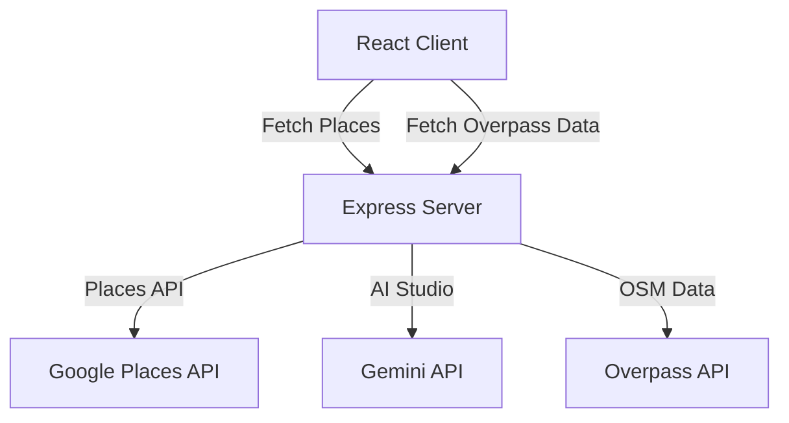

# System Context — HeliosPro

## Purpose
HeliosPro is a web application that visualizes real-time 3D building shadows on a city map grid to help users find sunlight for outdoor dining, hanging out, and photography. It runs solar trajectory math locally to project shadows on 3D extruded building shapes and integrates AI filtering to highlight venues matching specific sun-related contexts.

---

## System Architecture

The application is built as a single-page React client served by a lightweight Express proxy server to keep API keys secure and bypass CORS requirements.



### 1. Solar calculations
- SunCalc is used on the client-side to calculate the sun position based on:
  - Viewport center latitude/longitude.
  - Chosen date and time.
- The calculations output:
  - `azimuth` (sun angle clockwise from North).
  - `elevation` (altitude above the horizon).
  - Calculated Golden Hour and Blue Hour windows.

### 2. Rendering Stack
- **Base Map**: MapLibre GL JS loads and renders CartoDB vector basemaps (Dark Matter, Positron, Voyager).
- **3D Extrusions**: Deck.gl renders the buildings layer, fetching polygons from OpenStreetMap (OSM) via Overpass.
- **Lighting & Shadows**: Deck.gl's `LightingEffect` and `SunLight` cast real-time WebGL shadows. A custom polygon ground layer acts as the canvas that receives projected shadows.

### 3. Proxy Backend
- **Place Queries**: The proxy forwards search requests to the Google Places API text search.
- **AI Filtering**: Passes retrieved place details and user reviews to Gemini 2.5 Flash, which returns matching place IDs (e.g. confirming whether a spot has heated patios).
- **OSM proxy**: Forwards Overpass QL strings to public Overpass interpreters.

---

## Data Contracts

### 1. Place
Represents a filtered venue displayed as a pin on the map.
```typescript
interface Place {
  id: string;
  name: string;
  lat: number;
  lng: number;
  rating?: number;
  category: string;
}
```

### 2. Building Geometries
OSM ways converted to GeoJSON features for 3D extrusion.
```typescript
interface BuildingFeature {
  type: 'Feature';
  properties: {
    id: string;
    height: number;
    min_height: number;
    color: string;
  };
  geometry: {
    type: 'Polygon';
    coordinates: [number, number][][];
  };
}

interface BuildingCollection {
  type: 'FeatureCollection';
  features: BuildingFeature[];
}
```

### 3. Subway Geometries
OSM transit lines converted to GeoJSON LineStrings.
```typescript
interface SubwayLineFeature {
  type: 'Feature';
  properties: {
    id: string;
    name: string;
    color: string; // NYC Transit official line color hex
  };
  geometry: {
    type: 'LineString';
    coordinates: [number, number][];
  };
}

interface SubwayLineCollection {
  type: 'FeatureCollection';
  features: SubwayLineFeature[];
}
```

### 4. Solar Metrics
Outputs from suncalc calculations.
```typescript
interface SolarData {
  azimuth: number;
  elevation: number;
  goldenHourInfo: { start: Date; end: Date } | null;
  blueHourInfo: { start: Date; end: Date } | null;
  lightDirection: [number, number, number];
}
```

---

## Component Layout & Data Flow

1. **`App.tsx`**: State coordinator. Holds `date`, `viewState` (lat/lng/zoom), `mapMode`, and toggles for subways and the minimap.
2. **`ControlPanel.tsx`**: Renders the timeline slider and Golden Hour button. Updates the date/time state.
3. **`SearchOverlay.tsx`**: Manages city search, date picker, map settings (style and layer toggles), and active AI categories.
4. **`MapContainer.tsx`**: Receives viewState and settings.
   - Triggers debounced fetches to `/api/osm/buildings` and `/api/places/filter` when the center coordinate changes.
   - Instantiates Deck.gl with the dynamic layers (`ground-layer`, `subways-main-layer`, `3d-buildings`, `places-layer`, `places-labels`).
   - Renders the floating `<Map>` card (minimap) at the bottom-left.

---

## Current Status (2026-05-24)
- **Map Themes**: Dark, Light, and Natural/Voyager modes are fully integrated.
- **Minimap**: Bottom-left interactive minimap is completed, featuring dynamic scaling, NYC borough labels, and a pulsing locator dot.
- **Subway Overlays**: Subway tracks are dynamically rendered on both maps, with accurate NYC line colors (A/C/E blue, 1/2/3 red, etc.) mapped from OSM tags.
- **Verification**: Code fully compiles via TypeScript, and production bundles compile cleanly.
